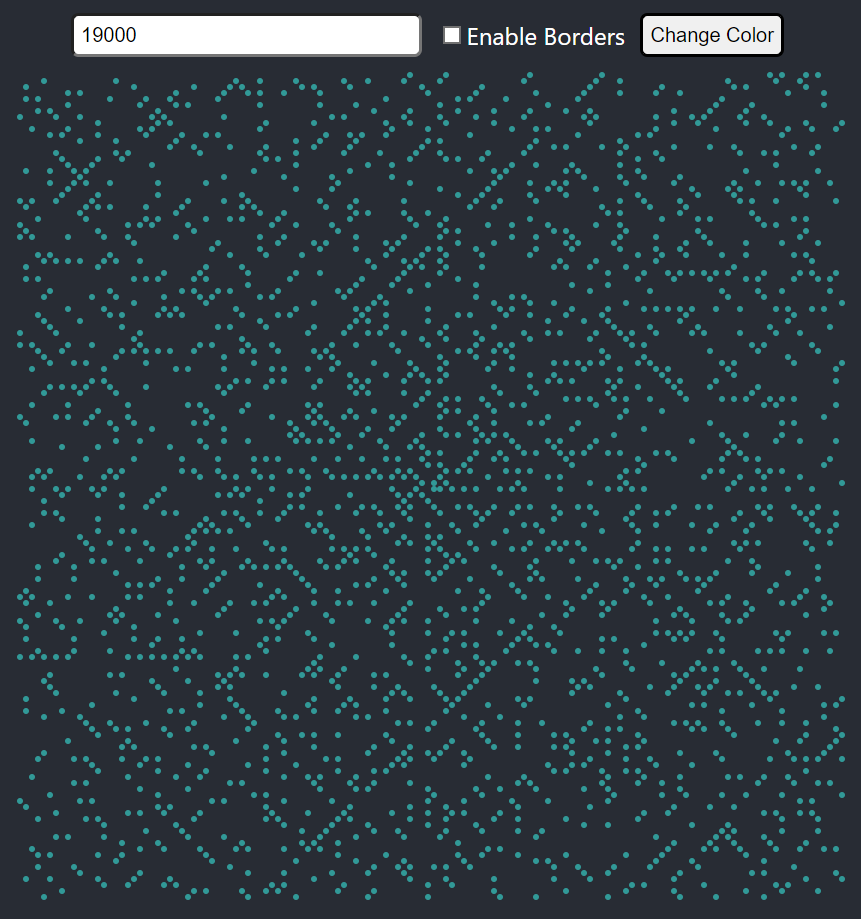

No desenvolvimento desse projeto utilizei ReactJs com componentes funcionais, hooks, contextApi.

Para criar o efeito visual utilizei flexbox montando um grid de fácil controle.
Dentro dessa flexbox adicionei de forma dinâmica divs para criação de células controladas por id.
Com as divs controladas pude adicionar a lógica de montar a espiral.
O desenho da espiral é um objeto populado com {'id': número} de forma que as células recuperam esse valor dinamicamente.
Após o espiral formado pude criar a função para checar se o número é primo e alterar a classe da div.
No CSS deixei o valor da div transparente em ambos os casos e o fundo colorido caso seja primo.

Por fim adicionei a possibilidade de mudar a cor das divs e uma hint ao passar o mouse pela div mostrando o número dela.
Para isso foram utilizadas as bibliotecas 'React-Color' e 'Tippy.js'.

Disclaimer: A aplicação em React acaba por consumir uma quantia considerável de memória, indico utilizar valores baixos para criação do padrão caso seu computador não tenha muita memória.

###################################################################################

In the development of this project I used ReactJs with functional components, hooks, contextApi.

To create the visual effect I used flexbox assembling a grid of easy control.
Inside this flexbox I dynamically added divs to create cells controlled by id.
With the divs under control I was able to add the logic to assemble the spiral.
The spiral design is an object populated with {'id': number} so the cells retrieve this value dynamically.
After the spiral formed I was able to create the function to check if the number is prime and change the class of the div.
In the CSS I made the value of the div transparent in both cases and the background colored in case it is prime.

Finally I added the possibility to change the color of the divs and a hint when hovering the mouse over the div showing its number.
For this, the 'React-Color' and 'Tippy.js' libraries were used.

Disclaimer: The application in React ends up consuming a considerable amount of memory, I recommend using low values to create the pattern if your computer does not have much memory.

